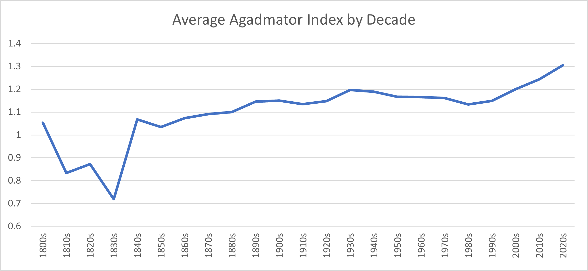

## The Agadmator Index - What is a Novelty?

This page contains some stats about novelties in chess games.

What is a novelty?  A novelty is that exciting moment when a move is played that
takes the game from a position that has been seen in previous games to a
position that hasn't been seen before.  One might say that this brings us to a
completely new game.

If you think about this definition ("a move that takes the game from a known
position to an unknown position"), you'll realize it means games can have
multiple novelties.  This is because after a game has reached a new position,
it's possible to transpose back to a position which has been encountered in the
past.  And from there the game may proceed to another unknown position.

Let's call the number of novelties in a game its "Agadmator Index".  Novelties
are exciting, so perhaps games with a high Agadmator index will be exciting.  We
can measure some related stats, while we're at it.

## What game has the highest Agadmator index?

Here are the three games with the highest Agadmator indices:

1.   Rozen, Eytan v Efroimski, Marsel (2021.3.15, event: 40th
     ch-ISR 2021 @ Haifa ISR, round 9.12)

     [This 233 move
     game](https://www.chessgames.com/perl/chessgame?gid=2163562), a Sicillian,
     has an Agadmator index of 32! The first novelty occurs on 14... Rd8, where
     black adds pressure on the d file.  The 31 remaining novelties occur in the
     endgame.  After move 68, white has a queen and 3 pawns vs black's queen
     and 2.  White tries to convert his advantage, but another capture
     doesn't occur until move 218.  That's 150 moves later!  Ultimately black
     defends to a draw.

     The novelties occur on these half-moves: [28; 139; 141; 169; 171; 175; 177;
     211; 237; 245; 247; 258; 273; 275; 293; 296; 300; 310; 314; 317; 319; 323;
     331; 336; 339; 343; 355; 375; 387; 395; 454; 459].  (To convert a half-move
     index to a move number, add 1 and divide by 2 - so 28 becomes the first
     novelty at move 14.5).

2. [Girya, Olga v Stefanova,
   Antoaneta](https://www.chessgames.com/perl/chessgame?gid=1898017)
   (2017.10.23, event: ch-EUR Women Blitz 2017 @ Monaco MNC, round 3.4)

   Agadmator index: 26.

3. [Okhotnik, Vladimir v Wittmann, Walter](https://www.chessgames.com/perl/chessgame?gid=1650098) (2011.11.19, event: 21. World Seniors @
   Rijeka CRO, round 5.11)

   Agadmator index: 25.

Are these games exciting?  Well, they are certainly long.

The full top 10 list, with the novelty move numbers, can be found in the [raw
stats document](stats.txt).

## Overall novelty stats

How exciting are chess games generally?  How common are novelties?

Of 4,549,640 games in the database I used, 4,385,146  have at least one novelty.
That's 96.38%!

The average game has an Agadmator index of 1.21.  White is a tiny bit more
likely than black to play at least one novelty (53.6% of games vs 52.9%).

We can also measure novelties by move, which is a little different.  Of the
363,070,839 moves in the database, 5,498,187 were novelties.  That's about 1.5
novelties every 100 moves.

## Novelties by year

Are chess games more or less exciting now than they were in the past?  Here
are the stats by decade:

So it seems chess is more exciting today than ever!  Here is the full breakdown:

| Decade | Agadmator Index | Novelties / 100mvs | # games | % of gms w/ novelties |
|-------|--------|------------|----------------|-------------|
|  1800 |  1.053 |       2.59 |             38 |      97.4%  |
|  1810 |  0.833 |       1.47 |             36 |      83.3%  |
|  1820 |  0.872 |       1.30 |             39 |      84.6%  |
|  1830 |  0.719 |       0.97 |            285 |      63.5%  |
|  1840 |  1.068 |       1.50 |            530 |      90.9%  |
|  1850 |  1.035 |       1.42 |           1435 |      90.1%  |
|  1860 |  1.073 |       1.57 |           1539 |      94.4%  |
|  1870 |  1.091 |       1.45 |           1291 |      94.6%  |
|  1880 |  1.100 |       1.34 |           2797 |      92.7%  |
|  1890 |  1.146 |       1.41 |           3497 |      96.1%  |
|  1900 |  1.150 |       1.46 |           6682 |      95.0%  |
|  1910 |  1.135 |       1.47 |           4645 |      95.1%  |
|  1920 |  1.148 |       1.49 |          10392 |      93.1%  |
|  1930 |  1.197 |       1.50 |          16301 |      96.2%  |
|  1940 |  1.189 |       1.47 |          16313 |      96.7%  |
|  1950 |  1.167 |       1.50 |          36689 |      95.3%  |
|  1960 |  1.166 |       1.58 |          69354 |      96.0%  |
|  1970 |  1.161 |       1.61 |         105339 |      95.8%  |
|  1980 |  1.134 |       1.54 |         295418 |      93.5%  |
|  1990 |  1.149 |       1.50 |         976905 |      93.9%  |
|  2000 |  1.200 |       1.52 |         960063 |      96.5%  |
|  2010 |  1.243 |       1.51 |        1562599 |      97.8%  |
|  2020 |  1.305 |       1.51 |         477419 |      98.9%  |

## Novelties by Player

How likely are individuals to play a novelty?  Let's call the average number of
novelties per game across a player's career that player's "Agadmator rating".

### World Champions

Which world champion has the highest Agadmator rating?  Magnus!  Here are the
stats:

|           Player    |    Agadmator Rating  | Novelties / 100mvs |  # games | % of gms w/ novelties |
|------------------------|---------|----------|-----------|------------|
|       Carlsen, Magnus  |  0.633  |   1.39   |    4072   |     54.3%  |
|  Kasimdzhanov, Rustam  |  0.615  |   1.48   |    1746   |     54.4%  |
|      Topalov, Veselin  |  0.598  |   1.39   |    2667   |     54.5%  |
|    Anand, Viswanathan  |  0.580  |   1.46   |    3654   |     53.3%  |
|      Capablanca, Jose  |  0.579  |   1.50   |    1116   |     52.3%  |
|    Ponomariov, Ruslan  |  0.570  |   1.30   |    2287   |     50.5%  |
|       Smyslov, Vasily  |  0.563  |   1.47   |    2965   |     51.4%  |
|    Botvinnik, Mikhail  |  0.563  |   1.35   |    1153   |     50.8%  |
|     Kramnik, Vladimir  |  0.557  |   1.35   |    3270   |     49.8%  |
|     Petrosian, Tigran  |  0.536  |   1.51   |    2191   |     47.2%  |
|        Spassky, Boris  |  0.533  |   1.55   |    2726   |     48.6%  |
|          Tal, Mikhail  |  0.524  |   1.47   |    2989   |     47.5%  |
|   Alekhine, Alexander  |  0.523  |   1.33   |    2187   |     47.7%  |
|       Kasparov, Garry  |  0.514  |   1.34   |    2560   |     46.9%  |
|             Euwe, Max  |  0.512  |   1.36   |    1500   |     46.4%  |
|       Fischer, Robert  |  0.508  |   1.28   |    1068   |     47.4%  |
|       Lasker, Emanuel  |  0.506  |   1.41   |     417   |     45.8%  |
|     Steinitz, Wilhelm  |  0.479  |   1.25   |     881   |     45.2%  |
|  Khalifman, Alexander  |  0.457  |   1.34   |    2552   |     42.2%  |

### Chess Personalities

How about chess streamers, youtubers, and commentators?  Here is a list,
including some of the most watch folks and the people who were on the streams I
happened to watch during the 2021 World Championship, again sorted by Agadmator
rating:

|           Player    |    Agadmator Rating  | Novelties / 100mvs |  # games | % of gms w/ novelties |
|----------------------|---------|----------|-------------|-----------|
|        Botez, Andrea |  0.714  |   1.76   |      14     |    64.3%  |
|     Botez, Alexandra |  0.713  |   1.60   |     157     |    64.3%  |
|Cramling, Anna        |  0.692  |   1.63   |     636     |    57.7%  |
|       Radic, Antonio |  0.688  |   1.81   |      16     |    62.5%  |
|           Zhou, Qiyu |  0.684  |   1.56   |     491     |    57.6%  |
|     Nakamura, Hikaru |  0.661  |   1.41   |    4072     |    55.2%  |
|       Rensch, Daniel |  0.659  |   1.55   |     331     |    60.1%  |
|         Rozman, Levy |  0.656  |   1.49   |     544     |    59.0%  |
|         Hansen, Eric |  0.655  |   1.49   |    1534     |    56.3%  |
|         Rosen, Eric  |  0.631  |   1.37   |     461     |    51.4%  |
|         Hess, Robert |  0.633  |   1.44   |     873     |    55.4%  |
|      Hambleton, Aman |  0.628  |   1.38   |     667     |    55.5%  |
|   Naroditsky, Daniel |  0.626  |   1.44   |    1095     |    52.5%  |
|     Caruana, Fabiano |  0.624  |   1.35   |    3014     |    54.7%  |
|    Howell, David     |  0.622  |   1.37   |    2135     |    54.5%  |
|         Rudolf, Anna |  0.613  |   1.37   |     751     |    52.6%  |
|       Tania, Sachdev |  0.605  |   1.41   |    1461     |    52.8%  |
|    Williams, Simon K |  0.580  |   1.43   |     848     |    51.1%  |
|      Houska, Jovanka |  0.580  |   1.31   |    1452     |    50.6%  |
|   Finegold, Benjamin |  0.534  |   1.39   |    1156     |    47.8%  |

According to the data, the Botez sisters have a very creative playing style.

### Top Overall

But which players in the whole database have the highest Agadmator rating?
Among players with at least 250 games, the top 5 by Agadmator rating are:

 | Player  | Agadmator Rating | Total games |
 |---------|----------------|-----------|
 | [Goltsev, Dmitry](https://ratings.fide.com/profile/24176710)  | 0.807 | 606  |
 | [Golubovskis, Maksims](https://ratings.fide.com/profile/11608528)  |  0.803 |290|
 | [Miroshnik, Ekaterina](https://ratings.fide.com/profile/34127698) | 0.797 |335 |
 | [Aslanov, Umid](https://ratings.fide.com/profile/13412620) | 0.792 |361 |
 | [Tharushi, T H D Niklesha](https://ratings.fide.com/profile/9918264) | 0.788 |353  |

These are all young players today.  The oldest, Goltsev, was born in 2000!
The fact that only one of these players has over 500 games suggests that it is
hard to sustain this level of novel play.

If those are the players who play the most novelties per game, we can also ask
which players play the most novelties per move.  Here are the top 5 among
players with at least 250 games in the database.

| Player  | Novelties / 100 moves | Total games |
|---------|----------------|-----------|
| [Wall, Bill](http://billwall.phpwebhosting.com/) | 2.682 |422 |
| NN  | 2.558 | 993 |
| [Mayer, Istvan](https://ratings.fide.com/profile/700908) | 2.298 | 537 |
| [Vine, Elzbieta](https://ratings.fide.com/profile/1119320) | 2.172 | 250  |
| [Golubovskis, Maksims](https://ratings.fide.com/profile/11608528) | 2.140 |290 |

One player, Golubovskis, appears on both lists.

Here we start to see some limitations of the data (more on methodology below).
"NN" is an abbreviation for No Name, which occurs in the database when there is
incomplete information for a game.

Also, Bill Wall (who you may know from his books and
[website](http://billwall.phpwebhosting.com/)) is listed here with only 422
games.  However, there are a further 2976 games with the player name of just
"Wall" that can't be easily disambiguated because it's too common of a last
name.  The vast majority of those games are surely Bill's.  Stunningly, "Wall"
is also very high in this list, coming in 9th with an average of 2.066 novelties
/ game, and is first among players with at least 1000 games.  Bill's chess
career demonstrates a stunning level of creativity.

## Databases and Methodology

I want to be very clear that this was a fun exercise, but none of it should be
taken as gospel.  The idea is very silly to begin with, and there are several
key challenges that add uncertainty in the data.

**If you're here for the fun stats, you can stop reading now - the rest of this
is just notes on how I dealt with the data.**

### Finding a good database

Is is hard to find a free, high quality database of chess games that can be
downloaded in its entirety.  I used [Caissabase](http://caissabase.co.uk/) -
with 4.56M games, this is a big collection.  I did some light editing of the
database, described below.  The final database I used, formatted for Scid vs PC,
is available on this project's github "releases" page.

It's great that this resource is available for free!  But the quality of the
data is low, on average - missing dates, ambiguous player names, duplicated
games, etc - so the results here are not completely accurate, and it's tricky to
know exactly how bad they are.

### Cleaning up the database

I removed some games from the database.  There are 5 games where an illegal move
is played (all cases where someone castles after having moved one of the
pieces).  I deleted those (though I think my code handles this fine, in the
end).

Caissabase includes a number of games with computer players.  I attempted to
remove all games where either player is a computer.  Computers play differently
than humans, and this definitely shows up in the stats.  Without removing
computers, Alphazero has the highest Agadmator rating.

I ended up deleting 12,665 games where I was confident that at least one player
is a computer.  I put the names of these players in
[computers.txt](computers.txt), for reference (I kept a list becuase I was
considering dealing with this programmatically, but that turned out to be
tricky).  There are many cases where computer systems are given names that are
just common human names (e.g., Fritz) or are named after top players (e.g.,
Mephisto Polgar and Kasparov Turbo).  Because names are often abbeviated, it's
impossible to disambiguate all of these occurances without a massive time sink
researching historical games.  When I couldn't tell, I left the games in.

I did some analysis to identify duplicate games.  There are definitely some in
there, but using Scid's features to find similar games I would put an upper
bound on the number of duplicates in the DB at 20k games or so, and probably
much less.  It was going to be a lot of work to eliminate these without
potentially deleting some non-duplicates, so I didn't.

### Dates

By far the hardest part of this exercise is trying to figure out when one game
comes before another.  The vast majority of games before 1980 only have a year
given in the database - no month or date.

I tried to disambiguate the order of games using event and round information,
when possible, but ultimately there are many early games which are ambiguously
ordered.  If a position first occurs in multiple games within the same year, and
I couldn't determine the order based on other factors, the novelty may be
credited incorrectly.  There is a lot of subtlety here - perhaps I'll write more
later.

These errors definitely occur, but since the database has many more games in
later years than earlier years, and later games are more likely to have more
specific dates, I'm hoping it's not so bad.

### Names

The final potential source of inaccuracies (that I know of) is names.  Some
games, particularly older ones, only have a surname, or a surname and an
initial.  For common names, this creates ambiguities (see Bill Wall, above).
Scid vs PC does have a nice feature to disambiguate names based on data from
FIDE - I used this and it corrected many games, but there remain players in
the DB who likely appear under 2 or 3 different names.

I did take detailed look at the names on the lists above, and corrected them as
much as is feasible.  Their numbers should be fairly accurate, though there are
some cases that would need more research than I had time for (e.g., there is a
player named Edward Lasker who was active and highly rated during much of
Emanual Lasker's life).
